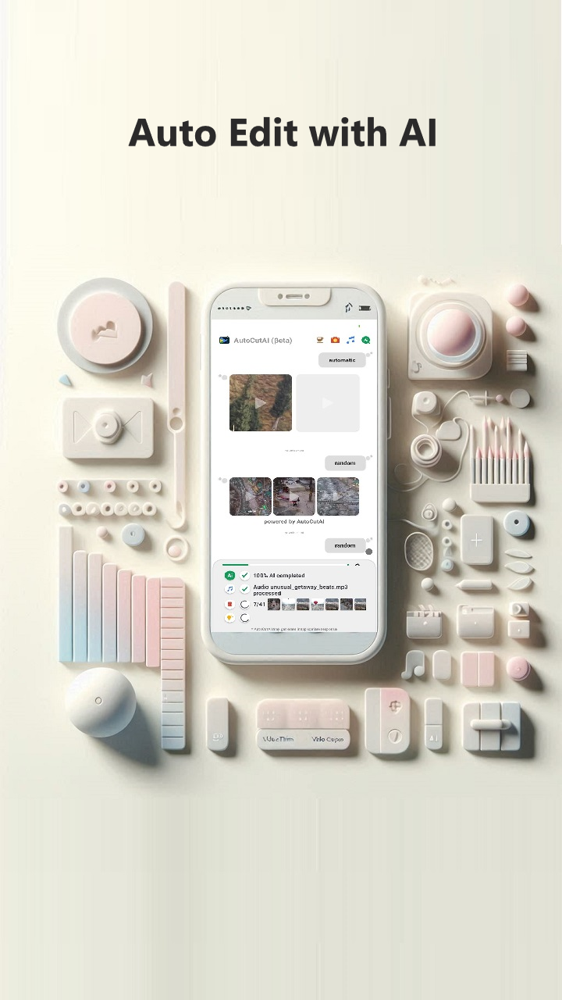
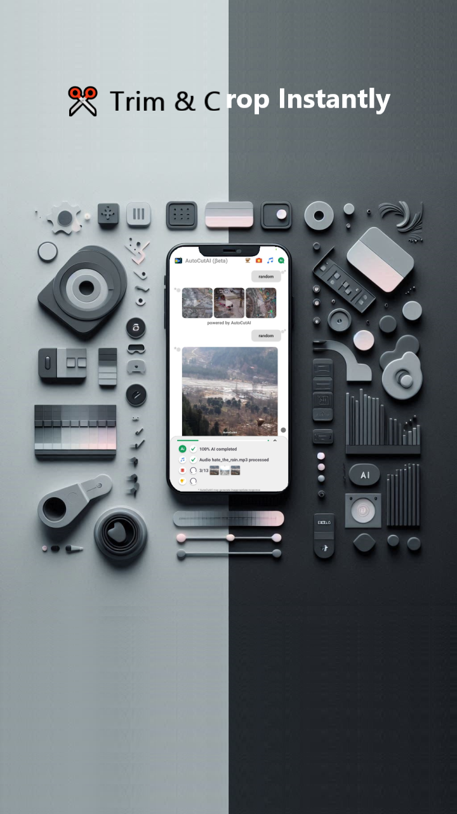
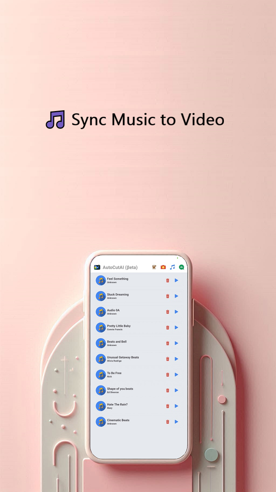
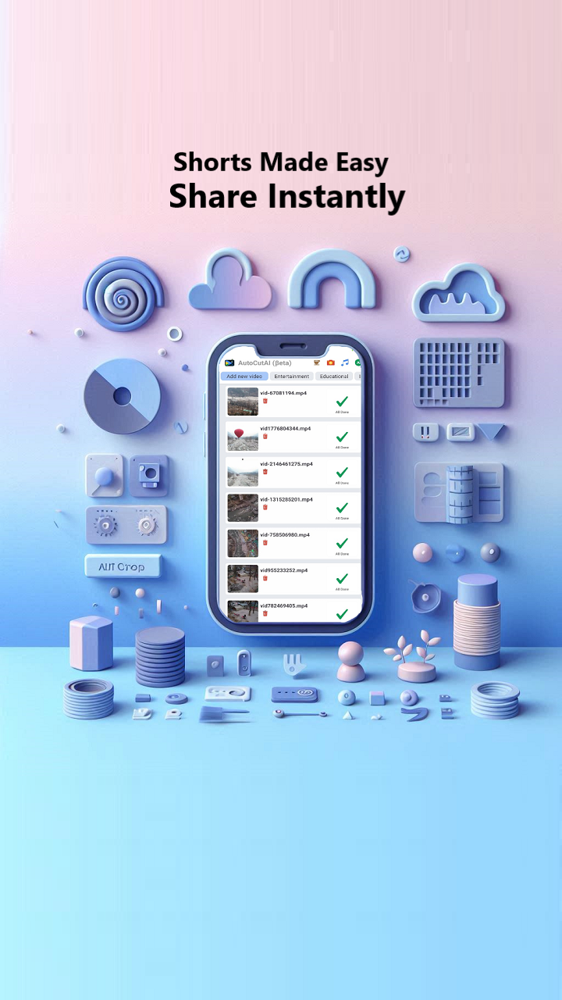
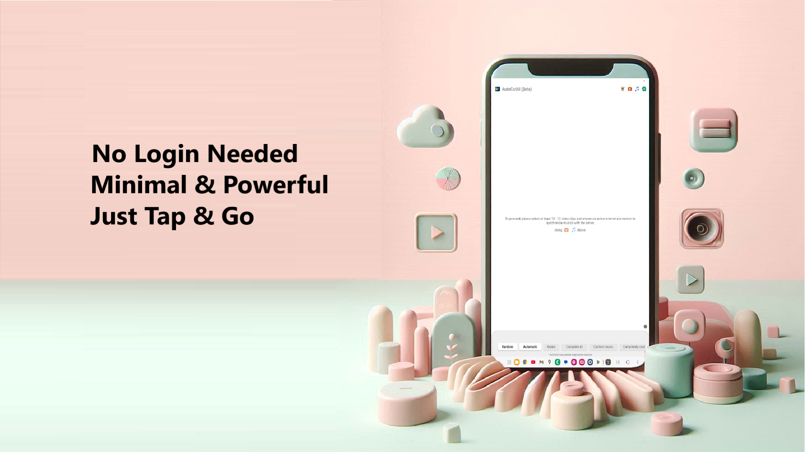
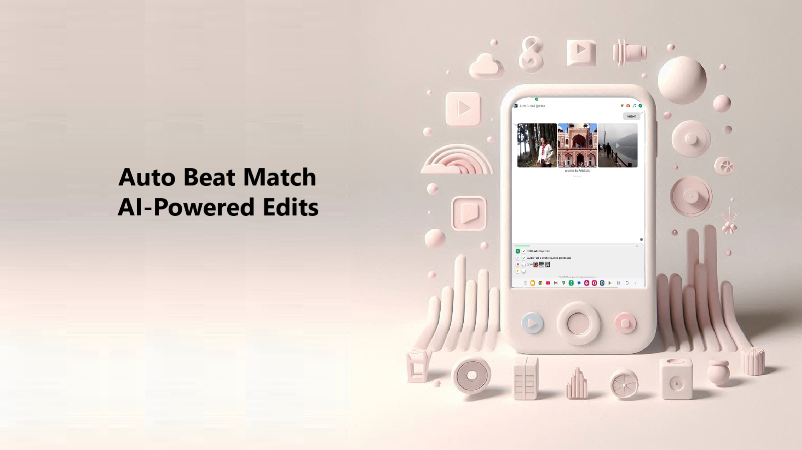

## AutoCutAI

> An AI-powered, offline-first mobile video editor built for creators who want fast, smart, and private editing – all on-device. Create stunning videos in seconds with AI-powered editing. Just select your clips—AutoCutAI trims, syncs to music, adds effects, and delivers ready-to-share videos. Fast, smart, and effortless. No editing skills needed.

**AutoCutAI** is a lightweight video editing app that brings intelligent editing to your fingertips. Built with performance and privacy in mind, it runs completely offline and supports:

- Automatic trimming
- Cropping
- Adding music
- Filters & effects
- Reels creation
- AI-powered suggestions

Whether you're a content creator, influencer, or casual user, AutoCutAI simplifies the editing process — no skill required.

## Features
- **AI-Powered**: Smart cut, auto music sync, and filter suggestions
- **Crop & Trim**: Simple timeline interface
- **Add Music**: Pick local tracks or built-in clips
- **Filters & Effects**: Modern, beautiful filters
- **Offline-first**: Works fully without internet
- **Made for Android**: Smooth performance even on budget devices

## Screenshots

  
  
  
  

  
  

## Download

Get it on Google Play:  [AutoCutAI on Play Store](https://play.google.com/store/apps/details?id=com.offlinew.autocutai)

## Releases
AutoCutAI v1.1.0 Puchu - Initial Beta release, Puchu refers to 2-3 years old human being, signifying capability of the AI used.

## Report Issues
Are you facing any issue related to AutoCutAI? Please do consider raising an issue. Issues are tracked on [github issues](https://github.com/mukuldeep/AutoCutAI/issues)

